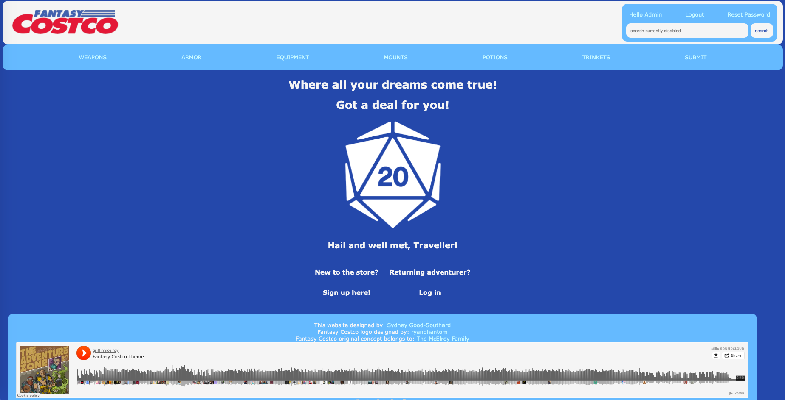
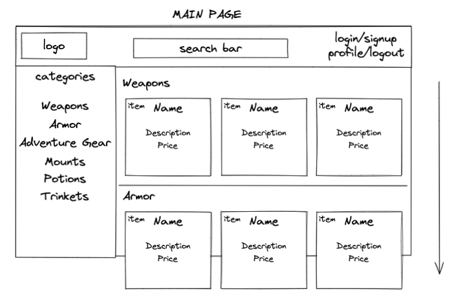
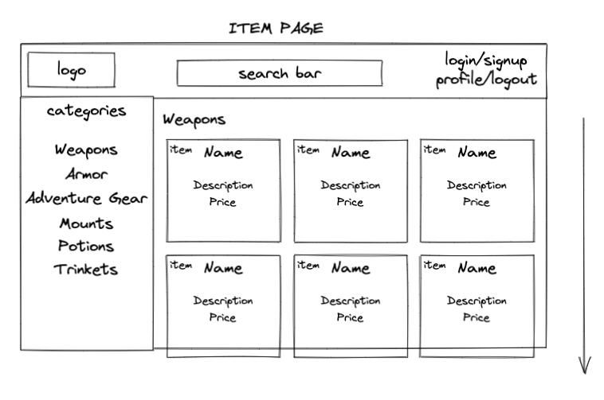
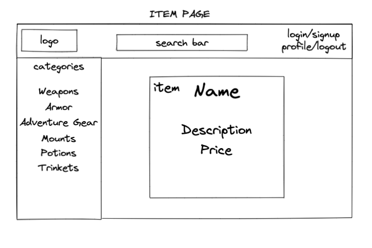

# [Fantasy Costco](https://mysite-ldql.onrender.com/)
## Where all your dreams come true!
## Got a deal for you!


# Tech Used
I decided to use just Django for this project since I found the structure of it fun to work in! I had never used Django before and a lot of the process was spent learning how to work within the constraints of the code since a lot of functions were already built in. 

The built in Authentication tools, and the Form tools were the things used the most in order to have the site function as a user submitted database. 

# The Approach
I built Fantasy Costco inspired by a podcast I really enjoy, The Adventure Zone. I wanted to build a fictional "store" that users could shop at for their Dungeons & Dragons needs. Users are able to sign up for an account and submit items to various categories. Users can also peruse these items for use in future Dungeons & Dragons games. Users can also update or delete items that they have made themselves if they'd like. 

For this to work, I set up Models for the various types of equipment. In the future I'd like to upgrade the complexity of these models to allow for damage types, statistics for combat and dice types to be used for the item. To be able to have Users access the items they had made, I added a "created_by" attribute to the items models. This links the tables together and allows the page to respond if a User has made the item or not. 
```
class Weapon(models.Model):
    name = models.CharField(max_length=150)
    description = models.CharField(max_length=5000)
    price = models.CharField(max_length=50)

    # added automatically when a user creates something
    created_by = models.ForeignKey(User, on_delete=models.CASCADE, null=True, blank=True)

    def __str__(self):
        return self.name
```

The submission of items relied on some base, Django code, which has a series of premade views for creating, updating and deleting a model. It was just a matter of customizing the blocks for each item category. The creation and update views use the same html form for both, which reduces pages. 
```
class WeaponCreateView(LoginRequiredMixin, CreateView):
    model = Weapon
    fields = ['name', 'description', 'price']
    success_url = '/weapon/'

    def form_valid(self, form):
        form.instance.created_by = self.request.user
        return super().form_valid(form)

class WeaponUpdateView(LoginRequiredMixin, UpdateView):
    model = Weapon
    fields = ['name', 'description', 'price']
    success_url = '/weapon/'


class WeaponDeleteView(LoginRequiredMixin, DeleteView):
    model = Weapon
    success_url = '/weapon/'
```

And finally the HTML and CSS we're built out to match the views. Most of the structure is reused for the various pages since they are displaying similiar things, which made styling much easier since I only had to apply class names more than IDs. I would like to take more time to build out the styling so updates will come as I add to them. 

# Installation instructions
1. Fork and clone the directory
2. cd into the main directory, the same as the requirements.txt
3. run ```pip3 install -r requirements.txt``` in your shell.
4. use ```python3 manage.py migrate``` to migrate the models into your database
5. Happy shopping Adventurer!

# Pitchdeck
## User Stories
I had a few User Stories when I began building this, though not all of them were utilized
- ```As a USER, I want to be able to upload items to the directory```
- ```As a USER, I want to have a list of favorite items accessible to me```
- ```As a USER, I want to customize my profile with player information```
- ```As a USER, I want to be able to search for items by keywords, or by category```
## Wireframes
These are the wireframes I used to plan out the layout and design choices for Fantasy Costco


a sketch of the original plan for the main page


a sketch of the index for an item category


a sketch of the show page for a single item

## Proposed Architecture
I really wanted to have a single page that all items run through, but for now each model runs through it's own set of forms and html pages. In the future I'd like to refactor it down based on which view it is running through and reduce the number of files in the repository. 

# Unsolved Problems/Hurdles
There were a few things I struggled with on this project that I look forward to updating.

- **Home Page**
  - I wanted the home page to display the most recent items, but since everything is it's own model, I struggled to figure out how to display any of them regardless of what category, and I was going to have a carosel of each category but I couldn't get that to work either so the home page is just a general landing page now. 
- **Profile Customization**
  - I also wanted users to be able to customize their Profiles to add email information or names or even D&D things, like their favorite class to play as or a favorite item they have. I used the Django Default User model which doesn't allow much customizing and you must adjust it early in the migrations to change that so I decided to let it go for the time being in the interest of finishing. I also wanted to display all the items the User has built themselves but I couldn't quite get that either, another future goal. 
- **DEPLOYMENT**
  - Deployment took over 24 hours to complete due to various issues and it took a lot of puzzling and commits to figure out how to make it work. My directory structure was not as good as it could have been, but I will take that lesson into my future when I deploy other apps.

# Stretch Goals

These are various things I want to add in the future, to fully upgrade this application. 
- **Latest Items on the Home Page**
  - I'd like to have the latest 3-5 items uploaded to show on the Home Page so people can see what the site has to offer
- **All Items Page**
  - A page where EVERYTHING in the database can display, likely split amongst numbered pages, either organized alphabetically or by date submitted.
- **Shopping Cart**
  - I'd like Users to be able to place items into a "Shopping Cart" for future game campaigns so they can come back to them later, to function as a Favorites List. 
- **Voting and Reviews**
  - I'd like for Users to be able to vote/like items and even review them to let other players know what they like and how they used them in their games.
- **Search Function**
  - I want to be able to implement a search function to find things either by keywords in the fields or by category and keywords or by date submitted or by user. 